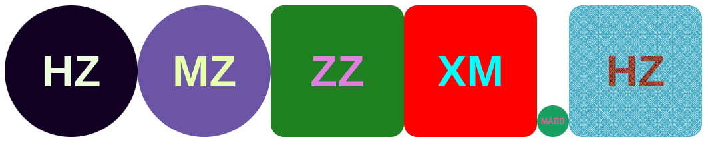

# avatar-vue3

This component works as avatar creator just as you might have seen avatars in microsoft teams.
It takes initials from full name and makes a display picture for that.
This components consists of vue3, typescript and css
It is useful when someone doesn't upload a picture in your web app, instead of showing the empty avatar there you can just pass there username or full name in the component and then it will create a picture with there name initials

 - Maximum component has been handled using props and is open source
-  It splits name by spaces and hyphens
-  Maximum length of avatar is 4 characters

# Examples

- **Anees** will become **A**
- **Anees Baig** will become **AB**
- **Mirza Anees Baig** will become **MAB**
- **Mirza Anees Baig Barlas** will become **MABB**
- **Anees-Baig** will become **AB**

# Usage

    npm install avatar-vue3
In file where you want to use the component add these imports

**In script**

    import {Avatar} from  'avatar-vue3'
    import 'avatar-vue3/style.css'
**In template**

    <Avatar
	    name="John Smith"
	    :radius="10"
	    :size="200"
	    image="https://amymhaddad.s3.amazonaws.com/morocco-blue.png"
    />
or

    <Avatar name="John Smith"/>

# Props

|  Property | Type  | Default | Decription |
|--|--|--|--|
|name  | String | - | Name you want to make avatar for |
|size|Number|48|size of the avatar component, width and height are same in **px**|
|image| String  | - | If you want to pass an image instead of a background color |
|color  | String | - | Color of background, otherwise it will be a random color  |
|fontSize|Number|-|Size of font in **px**, otherwise it will be adjusted according to the size of avatar|
|radius| Number | 50 | Border radius of the avatar component in **px**, validation value  >=  0  &&  value  <=  50 |
|fontColor| String | rgb(255, 255, 255) | Font color of Avatar initials|
|blend| Boolean | true | Blend name colors with the background color for contrast|
|splitTo| Number | 4 | The number of characters the name can split to|

# Playground

Go to https://mabbkhawaja.github.io/avatar-vue3/?path=/docs/avatar--docs for live examples

  

